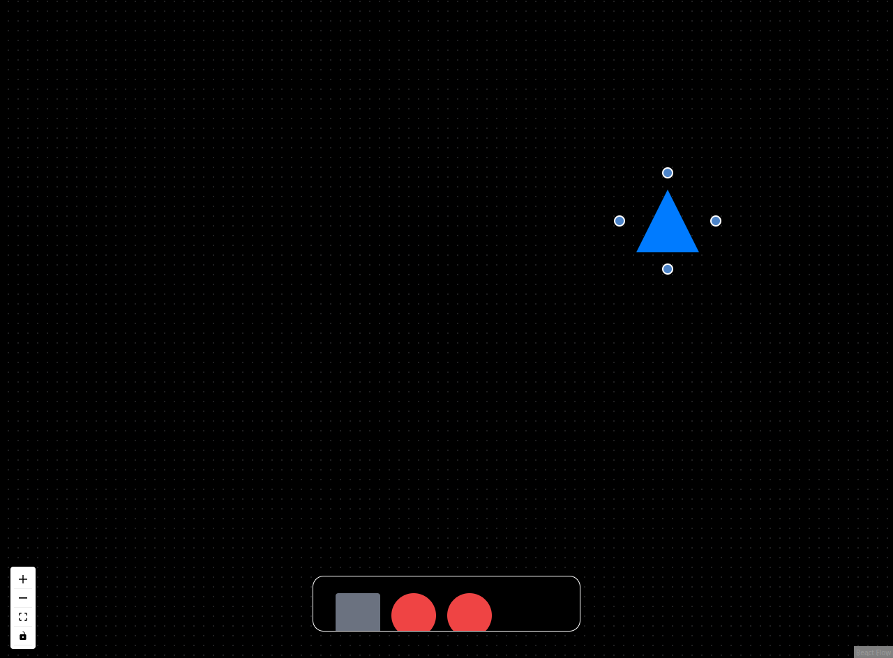

<h2 align="center">
  <br>
  <strong>Darkboard</strong>
</h2>


<p align="center">
  <a href="https://www.linkedin.com/in/pedrolcsf/">
    
  </a>
  
  
  
  <a href="https://github.com/pedrolcsf/darkboard/commits/master">
    
  </a>
  
  <a href="https://github.com/pedrolcsf/darkboard/issues">
    
  </a>
</p>




## 📃 About
The **Darkboard** is a version dark of whiteboard the functionality of this project
is to create flowcharts and other things of your creativity.

## 🚀 Technologies
Technologies that I used to develop this system
- [Node.js](https://nodejs.org/en/)
- [Vite](https://vitejs.dev/)
- [TypeScript](https://www.typescriptlang.org/)
- [TailWindCSS](https://tailwindcss.com/)

## 💻 Getting started
### Requirements
- [Node.js](https://nodejs.org/en/)
- [Yarn](https://classic.yarnpkg.com/) or [npm](https://www.npmjs.com/)

**Clone the project and access the folder**
```bash
  $ git clone https://github.com/pedrolcsf/darkboard.git
```
**Follow the steps below**
```bash
  # install the dependencies
  $ npm i

  # initialize the server (open in http:localhost:3000)
  $ npm run dev
```

---
Made with ♥ by Pedro Ferreira :wave: [Get in touch!](https://www.linkedin.com/in/pedrolcsf/)
